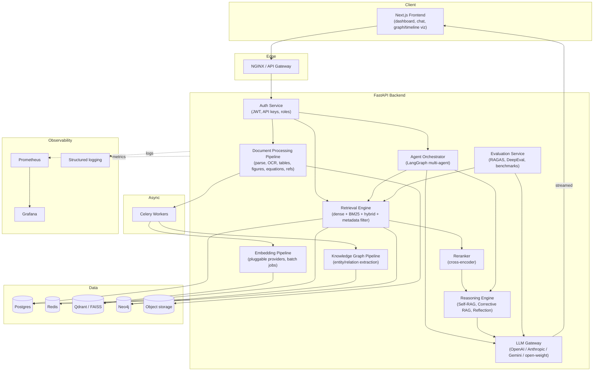
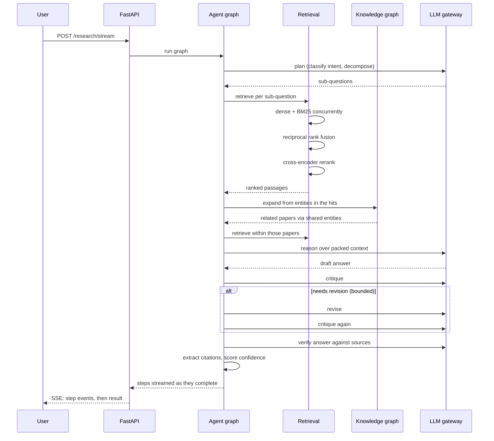
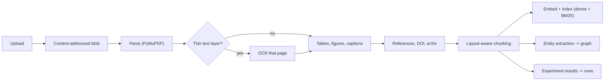

# Architecture Overview

ResearchMind AI is a research-oriented AI platform for ingesting, understanding, and reasoning over
large corpora of scientific papers. It is built as an enterprise-style modular system rather than a
single "RAG chatbot" script — each capability below is a distinct, independently testable component.

## High-level component diagram

## Component responsibilities

| Component | Responsibility |
|---|---|
| API Gateway (NGINX) | TLS termination, routing, request size limits |
| Auth Service | JWT auth, API keys, RBAC, rate limiting |
| Document Processing Pipeline | PDF parsing, OCR, table/figure/equation/reference extraction, layout-aware chunking |
| Embedding Pipeline | Pluggable embedding providers, batch embedding jobs, caching |
| Knowledge Graph Pipeline | LLM-assisted entity/relation extraction into Neo4j |
| Retrieval Engine | Dense + BM25 sparse + hybrid fusion + metadata/citation-aware filtering |
| Reranker | Cross-encoder relevance reranking of retrieved chunks |
| Agent Orchestrator | LangGraph graph of specialized agents (planner, retriever, critic, etc.) |
| Reasoning Engine | Self-RAG / Corrective RAG / reflection / context compression |
| LLM Gateway | Single abstraction over all LLM providers: streaming, retries, token accounting |
| Evaluation Service | RAGAS/DeepEval-based automated quality gates |
| Analytics/Admin Dashboard | Usage, cost, latency, agent behavior visibility |
| Monitoring | Prometheus metrics + Grafana dashboards + structured logs |

## Storage responsibilities

- **Postgres**: relational system-of-record — users, papers, jobs, citations, extracted structured entities.
- **Redis**: Celery broker/result backend, caching.
- **Qdrant (prod) / FAISS (dev)**: dense vector storage for chunk embeddings.
- **Neo4j**: knowledge graph — papers, authors, institutions, datasets, models, tasks, metrics, methods.
- **Object storage**: raw PDFs and extracted assets (figures, tables).

## Request path: a research question

The critic/reflector cycle is why this is a graph rather than a pipeline:
revision is conditional and repeatable, which a linear chain cannot express. The
loop is bounded inside the critic, because a critic and a reviser left to argue
will burn tokens indefinitely.

## Ingestion path

Each stage after parsing is its own Celery task. A transient provider outage
during embedding retries on its own rather than re-parsing a forty-page PDF.

## Retrieval, in detail

Dense and sparse retrieval answer different questions and fail in different
directions. Dense search finds a passage that means the same thing in different
words; BM25 finds an exact identifier like `WikiSQL` that an embedding blurs into
its neighbours. Neither is a superset of the other, so both run and their results
are fused.

Fusion is **reciprocal rank** rather than a weighted score sum, because cosine
similarity and BM25 scores are on incompatible scales — normalising them requires
knowing each distribution, and that distribution shifts with the corpus. RRF only
needs the ordering, which is exactly the part that is comparable.

Reranking is a second stage over an over-fetched candidate set (4x the requested
limit). Reranking exactly *k* results can only shuffle them; it cannot recover a
relevant passage that the first stage ranked at *k+1*.

Graph retrieval is a third source. Vector search cannot answer "which other
papers used this dataset", because that answer is a path rather than a passage.

## Design principles

1. **Everything behind an interface.** Storage, embeddings, vector store,
   reranker, OCR, graph store, LLM provider, and web search are all abstract
   interfaces with at least two implementations — one of which runs offline. That
   is what makes the entire system testable without a single container or key.
2. **Async by default.** Ingestion, embedding, and extraction are long-running and
   run as Celery tasks; the API stays responsive and reports job status.
3. **Explainable over magic.** Every ranked result carries the ranks that produced
   it, every agent records a step, and every generated query is returned to the
   caller. A system that cannot show its work cannot be debugged or trusted.
4. **Validate at the boundary, not after.** Model output is checked against a
   closed schema before it becomes state; generated Cypher is checked against a
   whitelist before it runs; uploads are checked by content rather than by what
   the client claims.
5. **Authorize before scoring.** Filtering results after ranking leaks through
   result counts and score distributions. The candidate set is scoped first.
6. **Incremental infra.** The full stack is declared in
   `infra/docker-compose.yml` from day one, but Qdrant, Neo4j, and the
   observability services are gated behind compose profiles until they are
   needed, so early development does not require running services nothing uses.

See [`docs/milestones.md`](./milestones.md) for the build plan,
[`docs/api.md`](./api.md) for the endpoint reference,
[`docs/security.md`](./security.md) for the threat model, and
[`docs/deployment.md`](./deployment.md) for how to run it.
