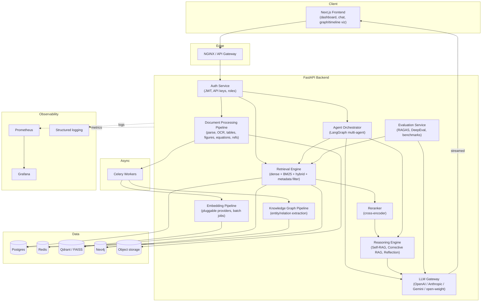

# Architecture Overview

ResearchMind AI is a research-oriented AI platform for ingesting, understanding, and reasoning over
large corpora of scientific papers. It is built as an enterprise-style modular system rather than a
single "RAG chatbot" script — each capability below is a distinct, independently testable component.

## High-level component diagram

## Component responsibilities

| Component | Responsibility |
|---|---|
| API Gateway (NGINX) | TLS termination, routing, request size limits |
| Auth Service | JWT auth, API keys, RBAC, rate limiting |
| Document Processing Pipeline | PDF parsing, OCR, table/figure/equation/reference extraction, layout-aware chunking |
| Embedding Pipeline | Pluggable embedding providers, batch embedding jobs, caching |
| Knowledge Graph Pipeline | LLM-assisted entity/relation extraction into Neo4j |
| Retrieval Engine | Dense + BM25 sparse + hybrid fusion + metadata/citation-aware filtering |
| Reranker | Cross-encoder relevance reranking of retrieved chunks |
| Agent Orchestrator | LangGraph graph of specialized agents (planner, retriever, critic, etc.) |
| Reasoning Engine | Self-RAG / Corrective RAG / reflection / context compression |
| LLM Gateway | Single abstraction over all LLM providers: streaming, retries, token accounting |
| Evaluation Service | RAGAS/DeepEval-based automated quality gates |
| Analytics/Admin Dashboard | Usage, cost, latency, agent behavior visibility |
| Monitoring | Prometheus metrics + Grafana dashboards + structured logs |

## Storage responsibilities

- **Postgres**: relational system-of-record — users, papers, jobs, citations, extracted structured entities.
- **Redis**: Celery broker/result backend, caching.
- **Qdrant (prod) / FAISS (dev)**: dense vector storage for chunk embeddings.
- **Neo4j**: knowledge graph — papers, authors, institutions, datasets, models, tasks, metrics, methods.
- **Object storage**: raw PDFs and extracted assets (figures, tables).

## Design principles

1. **Everything behind an interface.** Vector store, embedding provider, and LLM provider are all
   pluggable via small abstract interfaces so backends can be swapped without touching business logic.
2. **Async by default.** Ingestion, embedding, and KG extraction are long-running and run as Celery
   tasks; the API stays responsive and reports job status.
3. **Explainable over magic.** Multi-agent orchestration is hand-rolled with LangGraph rather than
   hidden inside a framework's black-box `.run()` call, so every step is inspectable and streamable
   to the frontend.
4. **Incremental infra.** The full target stack (Postgres, Redis, Qdrant, Neo4j) is declared in
   `infra/docker-compose.yml` from day one, but Qdrant/Neo4j are gated behind compose profiles until
   the milestones that use them, so early development doesn't require running services nothing uses yet.

See [`docs/milestones.md`](./milestones.md) for the incremental build plan.
